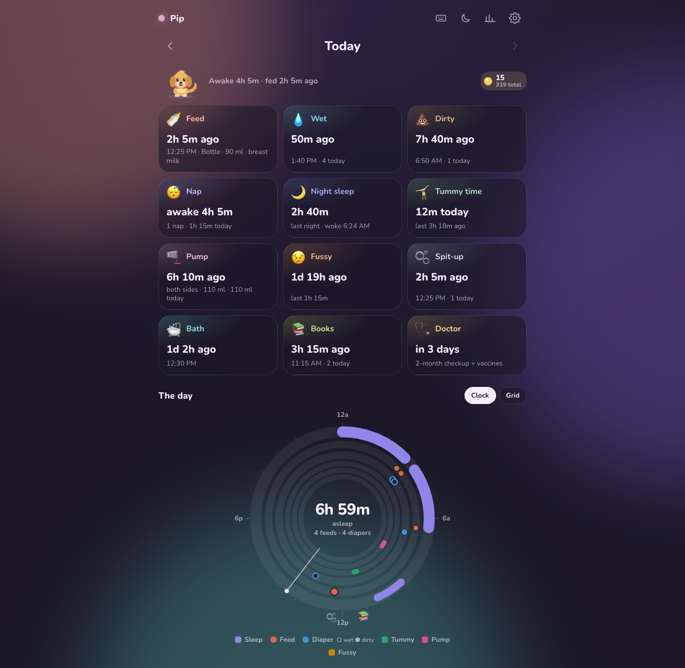
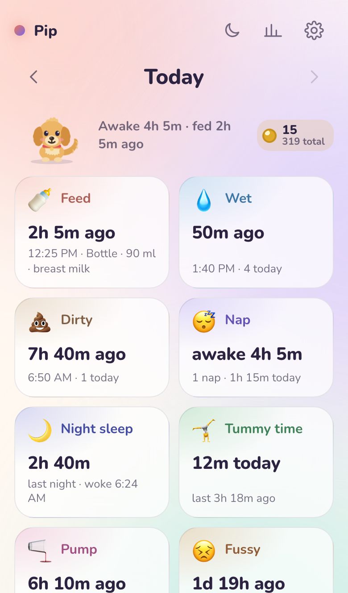
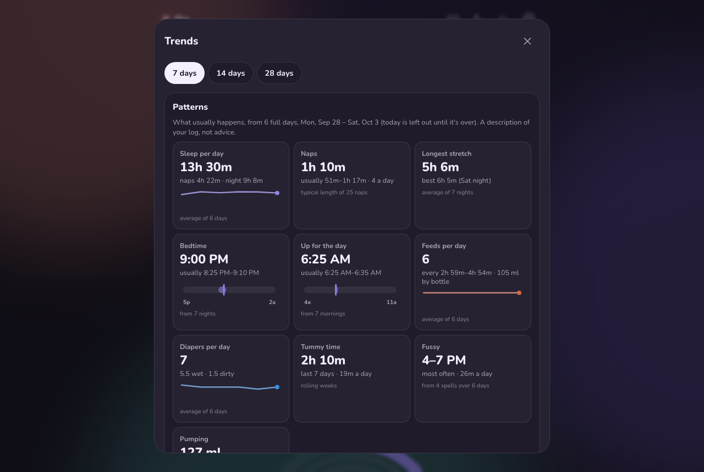

# 🌙 tinylog

An absurdly beautiful baby tracker that keeps everything on your phone. One tap logs a feed, diaper, nap, night sleep, tummy time, pump, fussy spell, spit-up, bath, book or doctor visit, and there are lovely ways to see the day.

**[Open the app →](https://parmsam.github.io/tinylog/)** It's free, with no account and no ads, and it works offline.

<p align="center">
  
  &nbsp;
  
</p>

## Install it on your phone

tinylog is a web app. Add it to your Home Screen and it opens full screen, works offline, and (on iPhone) keeps its data safe.

| Phone | How |
|---|---|
| **iPhone / iPad** (Safari) | **Share** (square with an arrow) → **Add to Home Screen** → **Add**. No Share button? Tap **⋯** first. |
| **Android** (Chrome) | **⋮** menu → **Add to Home screen** (or **Install app**) → **Install**. |

On iPhone, Safari can clear data for sites that aren't installed, so installing matters. The installed app also has its own storage, separate from Safari's. If you started in Safari, use **Export backup** there and **Import** in the installed app. **Settings → Install the app** has the same steps.

## Features

**Logging**
- **"When did we last…?" cards.** Tap a card to log it now. Timed things (nap, night sleep, tummy time, pump, fussy) are tap to start, tap to stop, and keep running across reloads.
- **Logging late is normal.** Every log shows a note with **Undo** and **−5m / −15m / −30m**. Hold a card to add details first: breast side and minutes per side, bottle amount, pump volume, a note.
- **Your buttons.** Settings → Buttons hides the cards you don't use.
- **One day at a time.** Step back through days to fill in or fix entries. A night that crosses midnight shows on both days, and each day has its own note.

**Seeing the day**
- **Over-engineered charts.** See each day as a 24-hour clock (the sleep arcs draw themselves in) or as an hour-by-hour grid. Trends has a day-by-day timeline, a time-of-day heatmap, a week of sleep rings and a daily totals table.
- **Patterns, not predictions.** Typical nap length, bedtime and wake-up windows, the longest stretch, feeds and diapers per day, and time between feeds. Each pattern says what it's based on and waits until there's enough data. tinylog never gives advice.
- **Day recap.** Turn any day into a shareable image (clock, totals, longest stretch, your note) or into Markdown.
- **Bedside display.** A dim, huge "since last feed / awake for" screen that keeps the phone awake.

**Delight**
- **A little companion.** Pick Puff the cloud, Sadie the mini golden retriever, Moon, Bunny, Duckling or Peanut, or a different one each day. They sip a bottle at feeds, doze while the baby sleeps and sigh with relief when a fussy spell ends.
- **Coins, medals and unlocks.** Every entry earns a coin. Milestones unlock outfits (bow tie, party hat, flower crown, crown, rainbow) and special friends (Star, Unicorn, Bumblebee). Nothing is ever spent or lost.
- **Night theme and backgrounds.** It's dim and warm from 9 PM to 6 AM, with calmer animation. Backgrounds are a soft glow or one of five gentle three.js scenes (night sky, fireflies, bubbles, crib mobile, snow), loaded only if you pick one.

**Your data**
- **Two phones.** Share an export (AirDrop, Messages) and import it on the other phone. Entries merge, the newest edit wins, and importing twice is harmless. The baby's name comes along too.
- **Backups.** A reminder every few days, with one tap to save a copy to Files, iCloud Drive or Google Drive.
- **Markdown export.** Copy any range of days (press `M` for today) to paste into Notes or Obsidian, or to bring to a checkup.

<p align="center">
  
</p>

## How it compares

Checked on 2026-10-04 against the App Store, Google Play and each project's own site. Prices are US prices and change often.

| App | Cost | Runs on | Account | Where your log lives | Two caregivers | Ads and tracking¹ | Source |
|---|---|---|---|---|---|---|---|
| **tinylog** | Free | Any phone or computer (web app, installable) | No | On your device only | Export and merge between phones | None | Open ([MIT](LICENSE)) |
| [Huckleberry](https://huckleberrycare.com) | Free; Plus $11.99/mo or $58.99/yr; Premium $14.99/mo or $119.99/yr | iOS, Android | Yes | Their cloud | Live sync (free) | Usage data used to track you | Closed |
| [Baby Tracker – Newborn Log](https://apps.apple.com/us/app/baby-tracker-newborn-log/id779656557) (Nighp) | Free with ads; no ads $4.99; Plus $5.99/mo or $49.99/yr | iOS, Apple Watch, Android | For sync | Phone, plus their cloud to sync | Live sync | Has ads | Closed |
| [Glow Baby](https://glowing.com/apps/baby-tracker) | Free; Premium $59.99/yr or $79.99 once | iOS, Android | Yes | Their cloud | Live sync | Data may be used to track you | Closed |
| [What to Expect](https://www.whattoexpect.com/mobile-app/) | Free | iOS, Android | Yes | Their cloud | — | Has ads; data used to track you | Closed |
| [BabyCenter](https://www.babycenter.com/mobile-apps) | Free | iOS, Android | Yes | Their cloud | — | Data used to track you | Closed |
| [Sprout Track](https://github.com/Oak-and-Sprout/sprout-track) | Free (you run the server) | Web app on your own server (Docker) | PIN per caregiver | Your server | Live, PIN per caregiver | None | Source available (custom license) |
| [Feed](https://jiamingfeng.github.io/feed-privacy/index.html) | Free | Android | No | On your device only | — | None | Open |

¹ For store apps, from Apple's privacy labels ("Data Used to Track You").

**Where tinylog fits:** it's for a family that wants a lovely, fast tracker with no sign-up, no subscription and no tracking, and doesn't mind backing up by hand.
- **Want live sync between two phones, sleep-time predictions or sleep coaching?** Huckleberry and Glow do that, through their cloud and paid plans.
- **Want live sync without a company in the middle?** Sprout Track does it on your own server.
- What to Expect and BabyCenter (both from Everyday Health) are pregnancy and parenting apps with a tracker inside.

## Keyboard shortcuts

Press <kbd>?</kbd> in the app to see them all.

| Key | Action |
|---|---|
| <kbd>F</kbd> <kbd>W</kbd> <kbd>D</kbd> | Feed, wet diaper, dirty diaper |
| <kbd>N</kbd> <kbd>S</kbd> | Start / stop a nap, night sleep |
| <kbd>T</kbd> <kbd>P</kbd> <kbd>C</kbd> | Start / stop tummy time, pump, fussy |
| <kbd>X</kbd> <kbd>B</kbd> <kbd>L</kbd> <kbd>O</kbd> | Spit-up, bath, book, doctor visit |
| <kbd>U</kbd> | Undo |
| <kbd>←</kbd> <kbd>→</kbd> <kbd>.</kbd> | Previous / next day, back to today |
| <kbd>G</kbd> <kbd>A</kbd> <kbd>R</kbd> <kbd>K</kbd> | Trends, bedside display, day recap, coins & rewards |
| <kbd>M</kbd> | Copy today as Markdown |
| <kbd>,</kbd> | Settings |

## Siri, Shortcuts and links

Any link with `?do=` logs something when opened, with the usual Undo. **Settings → Shortcuts & Siri** lists ready-made links to copy.

| Link | Does |
|---|---|
| `?do=log&what=wet` | Log a wet diaper (also `dirty`, `both`, `spitup`, `bath`, `books`, `doctor`) |
| `?do=log&what=bottle&ml=90` | Log a 90 ml bottle (`oz=3` works too) |
| `?do=toggle&what=sleep` | Start or stop sleep: a nap by day, night sleep in the evening |
| `?do=log&what=wet&ago=15` | Log it as 15 minutes ago |

- **iPhone:** in the Shortcuts app, tap New Shortcut → **Open URLs**, paste a link and name it "Wet diaper". Then say "Hey Siri, wet diaper". Links open in Safari, which has its own storage, separate from the Home Screen app. So if you log by Siri, either use tinylog in Safari on that phone or merge the two with Share with partner.
- **Android and desktop:** long-press the installed app's icon for Feed, Wet, Dirty and Sleep.
- **AI agents and scripts** driving the page can call `window.tinylog` (see [`llms.txt`](public/llms.txt)).

## Privacy

Everything stays in your browser: IndexedDB, with a second copy in localStorage. There are no accounts, servers or analytics, and the only network request is for the font. Export a backup now and then; the app reminds you. tinylog describes what you logged. It isn't medical advice.

## Development

Requires Node 24.

```sh
npm install
npm run dev        # http://localhost:5173/tinylog/
npm run check      # typecheck + unit + end-to-end tests; run before committing
SCREENSHOTS=1 npx playwright test screenshots --project=chromium   # refresh docs/*.png
```

| | |
|---|---|
| Stack | Vite + TypeScript (no UI framework), anime.js v4, hand-written SVG charts, three.js (lazy-loaded scenes), vite-plugin-pwa |
| Storage | IndexedDB with a localStorage mirror; settings in localStorage |
| Unit tests | Vitest (jsdom), run in `America/New_York` to catch DST bugs |
| E2E tests | Playwright on Chromium, WebKit, an Android phone, iPhone layout, and the production build (offline) |
| CI / deploy | Every push runs the tests; `main` deploys to GitHub Pages only if they pass |

The plan and decisions log live in [`PLAN.md`](PLAN.md), and conventions for contributors (human or AI) in [`AGENTS.md`](AGENTS.md). Sibling project: [pomotimer2](https://github.com/parmsam/pomotimer2).

## License

[MIT](LICENSE) © 2026 Sam Parmar
